<!-- Profile README — renders at https://github.com/shravanibnikam · assets are generated: uv run build.py -->

<picture><source media="(prefers-color-scheme: dark)" srcset="assets/hero-dark.svg"></picture>

<a href="https://www.linkedin.com/in/shravaninikam/"><picture><source media="(prefers-color-scheme: dark)" srcset="assets/btn-linkedin-dark.svg"></picture></a>&nbsp;&nbsp;<a href="mailto:shravanibnikam@gmail.com"><picture><source media="(prefers-color-scheme: dark)" srcset="assets/btn-email-dark.svg"></picture></a>

<picture><source media="(prefers-color-scheme: dark)" srcset="assets/stats-dark.svg"></picture>

I'm a backend engineer, and I like building things that survive concurrency: schemas, migrations, query plans, and sync that still converges after two devices spend a week offline. I'm doing an **MS in Computer Science at Northeastern University** in Seattle. My rule is to measure it, then believe it.

**Open to work:** a co-op for Spring/Summer 2027, and full-time from January 2028. Happy to relocate.

## ~/projects

<a href="https://github.com/shravanibnikam/query-plan-lab"><picture><source media="(prefers-color-scheme: dark)" srcset="assets/card-query-plan-lab-dark.svg"></picture></a><a href="https://github.com/shravanibnikam/rhea-period-tracker"><picture><source media="(prefers-color-scheme: dark)" srcset="assets/card-rhea-dark.svg"></picture></a>
<a href="https://github.com/shravanibnikam/mergelag"><picture><source media="(prefers-color-scheme: dark)" srcset="assets/card-mergelag-dark.svg"></picture></a><a href="https://github.com/shravanibnikam/hallucination-hunter"><picture><source media="(prefers-color-scheme: dark)" srcset="assets/card-hallucination-hunter-dark.svg"></picture></a>

Live: <a href="https://shravanibnikam.github.io/rhea-period-tracker/">Rhea</a> · Rebuilding: <a href="https://github.com/shravanibnikam/Third-Place-Finder-Web">third-place-finder</a>, a Seattle study-spot finder with a new backend and UI

## ~/log

<picture><source media="(prefers-color-scheme: dark)" srcset="assets/log-dark.svg"></picture>

## ~/loadout

<picture><source media="(prefers-color-scheme: dark)" srcset="assets/stack-dark.svg"></picture>

<code>connection established</code> · Seattle, WA · <a href="mailto:shravanibnikam@gmail.com">shravanibnikam@gmail.com</a> · <a href="https://www.linkedin.com/in/shravaninikam/">linkedin.com/in/shravaninikam</a>

